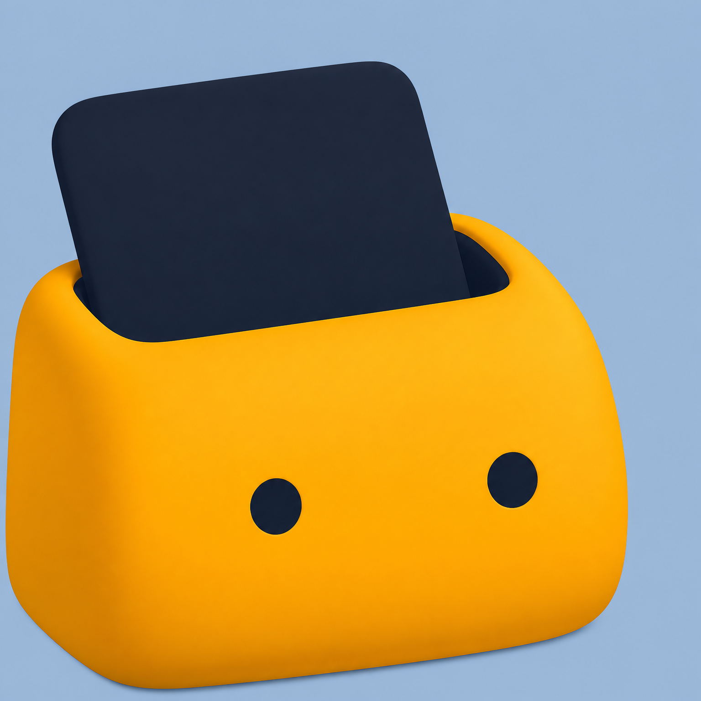

<div align="center">
  
  <h1>AIGC Gallery · 藏画匣</h1>
  <p>收藏 AI 生成图片，整理画师串，读懂每张图的生成参数。</p>
  <p>
    
    
    <a href="#浏览器兼容性"></a>
    
  </p>
  <p><strong>简体中文</strong> · <a href="README.en.md">English</a></p>
  <p>
    <a href="https://github.com/jsh135790/AIGC-Gallery/releases">下载发布版</a> ·
    <a href="CHANGELOG.md">更新日志</a> ·
    <a href="https://github.com/jsh135790/AIGC-Gallery/issues">反馈问题</a> ·
    <a href="LICENSE">GPL-3.0</a>
  </p>
</div>

AIGC Gallery 是一款完全在浏览器中运行的本地 AI 图片管理工具，无需账号、后端或 API Key。图片与图库记录保存在当前浏览器的 IndexedDB 中，设置保存在本地；图片导入、元数据解析、编辑和备份均在本机完成，不上传到服务器。

构建产物是一个自包含的 `index.html`，可以离线使用，也可以部署到静态网站。

## 核心功能

| 功能 | 可以做什么 |
| --- | --- |
| AIGC 图库 | 拖拽或批量导入图片，按文件夹和标签筛选，搜索、收藏、批量删除，切换网格与瀑布流视图 |
| 画师串画廊 | 按自定义分组管理画师串，保存示例图、分类、标签、收藏和评分，复制提示词，导入 / 导出 JSON 资料 |
| 元数据编辑器 | 编辑 SD WebUI / NovelAI PNG 的正负提示词、生成参数和 NovelAI v4 角色提示词，查看改动、逐项撤销、导出 PNG 或回写图库 |
| 元数据查看器 | 查看原始元数据条目、解析字段和读取诊断，支持 ComfyUI；检查图库元数据并按需补全缺失信息 |
| 存储与备份 | 查看存储用量和保护状态，申请持久存储，将两个库完整备份到文件夹并恢复到空库 |
| 界面设置 | 中英文切换、系统语言识别、浅色 / 深色 / 跟随系统主题、自定义主题色和模糊效果 |

工具箱中的「图片反推提示词」目前是占位入口，尚未实现。

## 快速开始

### 下载使用

1. 在 [Releases](https://github.com/jsh135790/AIGC-Gallery/releases) 下载发布包并解压。
2. 使用近期版本的桌面 Chrome 或 Edge 打开其中的 `index.html`。
3. 进入 **AIGC 图库** 导入图片，或进入 **画师串画廊** 添加画师资料。

如需完整文件夹备份与恢复，推荐通过 **HTTPS 或 localhost** 访问。直接打开 HTML 时，这些功能的可用性取决于浏览器，页面会显示实际支持情况。浏览器兼容性详见下表。

**请保留固定的使用入口。** 图库按浏览器、配置文件和页面来源隔离。更换协议、域名、端口或浏览器配置，以及移动本地 HTML 文件，都可能打开另一份存储空间。图库不会自动迁移；更换入口前请先在原入口完成备份。

### 从源码运行

推荐使用 **Node.js 24 LTS** 和 npm；也可使用 Node.js 22.12+ 的 22.x 版本。

```bash
git clone https://github.com/jsh135790/AIGC-Gallery.git
cd AIGC-Gallery
npm ci
npm run dev
```

打开 [http://localhost:5173](http://localhost:5173)。开发端口固定为 **5173**，占用时会报错，不会自动切换端口。

```bash
npm run build
```

构建后得到 `dist/index.html`，脚本与样式均内联在这个文件中。

## 元数据支持范围

| 图片 / 元数据格式 | 读取与查看 | 编辑与导出 |
| --- | --- | --- |
| SD WebUI PNG | 提示词、负向提示词、生成参数及额外字段 | 支持，导出 SD 格式 PNG |
| NovelAI PNG | 标准元数据、v4 多角色提示词与角色位置 | 支持，包含各角色的正负提示词 |
| NovelAI Stealth PNG | 读取隐藏在透明通道中的元数据 | 修改写入标准 PNG 文本块，透明通道中的隐藏副本不会同步更新 |
| ComfyUI PNG | 工作流与 API 格式、可识别的参数、节点信息 | 只读，不支持编辑工作流或写回 |
| JPEG / WebP / AVIF | EXIF `UserComment`；识别其中的 SD 参数文本 | 不支持写回，不是完整 EXIF / XMP 编辑器 |
| 无可识别元数据的 PNG | 显示未识别状态，可在查看器检查原始条目 | 可填写内容并选择导出为 SD 或 NAI 格式 |

解析器根据文件内容识别容器格式。ComfyUI 自定义节点会计入节点信息，但不会猜测其输入字段的含义。图片本身需要包含相应元数据，才能读取到生成参数。

### 编辑图片参数

在 **工具箱 → 元数据编辑器** 上传 PNG，或从图库图片详情进入编辑器。修改后可以导出新 PNG；从图库打开的受支持图片还可以回写当前图库记录。导出和回写都不会覆盖你最初从磁盘选择的文件。

编辑器以原始元数据为基础更新字段，保留未修改的额外信息；导出会附带 AIGC Gallery 编辑时间与版本记录。切换工具或页面会保留当前编辑会话，刷新或关闭页面前请先导出或回写。

### 检查与补全元数据

在 **工具箱 → 元数据查看器** 中，可以依次查看原始条目、解析字段，以及格式匹配、编码回退和未消费字段等诊断信息。条目同时显示字节数与解码后的字符数，便于检查压缩或编码问题。

「检查图库元数据」会重新读取原图，与已存记录对比，**检查本身不会修改图库**。按需补全时，仅填充缺失参数、更新原始元数据及相关解析信息；只有从未成功解析的记录才会补读提示词，不会覆盖已有提示词、手动标签、收藏和文件夹归属。

导入图片时，「从提示词自动提取标签」默认关闭。使用逗号分隔的标签式提示词时，可在 **关于 → 功能设置** 开启，仅影响之后导入的图片。

## 存储保护与完整备份

入口：**关于 → 存储与备份**。

### 存储保护是否开启？

以页面显示的 **「存储保护已开启」** 为准。检测到用户数据后，应用每次页面会话最多自动申请一次，也可手动申请。

Edge / Chrome 通常自动决定是否批准，不一定弹出权限框。未获批准时，页面会明确显示「存储保护仍未开启」，并提供「重新申请」；申请异常会显示错误提示。应用无法强制浏览器批准，控制台没有报错也不代表成功。

持久存储保护可以防止浏览器在存储空间不足时自动清理图库，**不能防止手动清除网站数据，也不能代替备份**。页面显示的用量与上限是浏览器估算值，不代表磁盘剩余空间。

### 备份到文件夹

点击 **备份到文件夹** 并选择保存位置。每次操作创建一个带时间的独立快照目录，旧备份会保留，每份快照大约再占用一份完整图库的空间。

完整备份包含：

- 两个库的原图、缩略图和画师资料。
- 画师分组、图库文件夹、标签、收藏、画师评分和已保存的编辑。
- 语言、主题、主题色及导入偏好等已保存设置。

图片按库中保存的原始字节与格式备份，不会重新编码或重写元数据。所有图片文件写入并通过 SHA-256 校验后，才保存最终的 `index.json` 清单。取消或未完成的备份不能用于恢复；请完整保留快照目录。

画师串画廊的 **JSON 导出只用于分享资料，不含图片**，不能代替完整备份。最近备份时间也只是本机记录，并不代表备份文件仍然存在。

### 从备份恢复

1. 在目标入口打开一个**空图库**，关闭旧版本应用页面。
2. 点击 **选择备份恢复**，选择包含 `index.json` 的快照子目录。
3. 核对检查通过后的摘要，点击 **恢复到当前空库**。
4. 完成后重新加载应用；其他打开的应用标签页也需要重新加载。

恢复不会合并或覆盖已有图库；未修改的自动默认画师分组不影响空库判断。文件校验失败时不会导入，数据库写入失败时整次恢复回滚。图库恢复成功后，若部分设置恢复失败，可以单独重试恢复设置。

## 浏览器兼容性

| 功能 | 桌面 Chrome / Edge | Firefox / Safari |
| --- | --- | --- |
| 图库、画师库、元数据工具 | 推荐使用近期稳定版 | 需要 IndexedDB 及对应图片格式支持；以实际运行情况为准 |
| 存储保护 | 根据浏览器策略批准或拒绝 | 取决于浏览器是否提供并批准持久存储 API |
| 完整文件夹备份 / 恢复 | 需要 File System Access、Web Locks 和 Web Crypto，推荐 HTTPS / localhost | 当前不提供 |

功能入口按浏览器实际能力检测。无痕 / 隐私模式不适合长期保存图库；跨浏览器或更换配置文件需要自行备份和迁移。

## 开发与贡献

技术栈：Vue 3、TypeScript、Vite、Pinia、Dexie / IndexedDB、Tailwind CSS v4、shadcn-vue / Reka UI，以及 ExifReader、pako 和 PNG chunk 工具。

| 命令 | 用途 |
| --- | --- |
| `npm run dev` | 启动开发服务，固定端口 5173 |
| `npm run build` | 运行类型检查并构建单文件 HTML |
| `npm test` | 运行全部 Vitest 测试，涵盖解析、元数据往返、存储状态、备份恢复与写入协调 |
| `npm run test:watch` | 监听模式运行测试 |

如需第二个开发实例，可使用 `npm run dev -- --port 5180`。它使用独立存储，不会共享 5173 的图库。

欢迎提交 [Issue](https://github.com/jsh135790/AIGC-Gallery/issues) 或 Pull Request。反馈元数据问题时，请附上生成工具、浏览器版本、复现步骤，以及可以公开的样例图或查看器诊断信息。新增界面文案请同步中英文；修改解析器后请运行测试。

## 开源协议与致谢

本项目采用 [GPL-3.0](LICENSE) 协议。

感谢 [shadcn-vue](https://www.shadcn-vue.com/)、[Reka UI](https://reka-ui.com/)、[Dexie.js](https://dexie.org/) 和 [ExifReader](https://github.com/mattiasw/ExifReader) 等开源项目。
